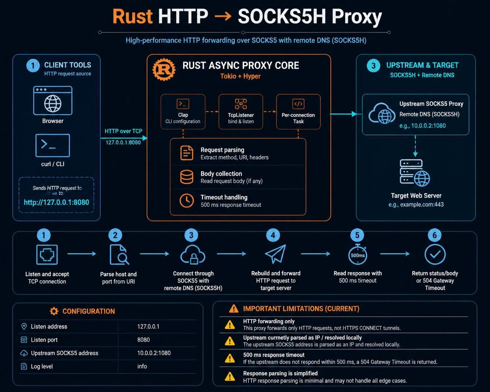

### karako_http_socks5h_proxy


HTTP/1.1 forwarder proxy server to upstream SOCKS5h server with DNS resolution on remote.  
lightweight. high-performance. written in Rust.  

<hr/>

```txt
  ╔════════════════╗
  │  HTTP Client   │
  └────────┬───────┘
           │ HTTP Request
           ▼
┌──────────────────────┐
│   karako_proxy       │
│  (This Service)      │
└─────────┬────────────┘
          │ SOCKS5H Protocol
          ▼
┌──────────────────────┐
│  Upstream SOCKS5     │
│  Proxy Server        │
└─────────┬────────────┘
          │ Forward Request
          ▼
   ╔════════════════╗
   │ Target Server  │
   └────────────────┘
```

<hr/>

## Features

| Feature              | Details                                      |
|----------------------|----------------------------------------------|
| **SOCKS5H Support**  | Remote DNS resolution via SOCKS5 proxy       |
| **HTTP Forwarding**  | Full HTTP/1.1 request forwarding capability  |
| **Async Runtime**    | Built on Tokio for high concurrency          |
| **Configurable**     | CLI flags for host, port, and log level      |
| **Logging**          | Structured logging with configurable levels  |
| **Lightweight**      | Minimal dependencies, fast compilation       |

<hr/>

  

<hr/>

### Run with default settings (127.0.0.1:8080 → SOCKS5)
`karako_http_socks5h_proxy -u 192.168.1.100:1080`

### Custom listen address and port
`karako_http_socks5h_proxy -l 0.0.0.0 -p 3128 -u proxy.example.com:1080`

### Enable debug logging
`karako_http_socks5h_proxy -u 192.168.1.100:1080 --log-level debug`

### Configuration
| Option              | Short   | Default     | Description                                               |
|---------------------|---------|-------------|-----------------------------------------------------------|
| `--listen-addr`     | `-l`    | `127.0.0.1` | Local address to bind to                                  |
| `--listen-port`     | `-p`    | `8080`      | Local port to listen on                                   |
| `--upstream-socks5` | `-u`    | Required    | SOCKS5 proxy address (format: `host:port`)                |
| `--log-level`       | `—`     | `info`      | Logging level: `trace`, `debug`, `info`, `warn`, `error`  |

<hr/>

## Architecture

### Request Flow

```txt
┌─────────────────────────────────────────────────────────┐
│ 1. Accept incoming HTTP connection from client          │
└──────────────────┬──────────────────────────────────────┘
                   │
┌──────────────────▼──────────────────────────────────────┐
│ 2. Parse HTTP request (method, URI, headers, body)      │
└──────────────────┬──────────────────────────────────────┘
                   │
┌──────────────────▼──────────────────────────────────────┐
│ 3. Extract target host:port from request URI            │
└──────────────────┬──────────────────────────────────────┘
                   │
┌──────────────────▼──────────────────────────────────────┐
│ 4. Connect to upstream SOCKS5 proxy (Socks5Stream)      │
└──────────────────┬──────────────────────────────────────┘
                   │
┌──────────────────▼──────────────────────────────────────┐
│ 5. Send HTTP request through SOCKS5 tunnel              │
└──────────────────┬──────────────────────────────────────┘
                   │
┌──────────────────▼──────────────────────────────────────┐
│ 6. Receive response from remote server (500ms timeout)  │
└──────────────────┬──────────────────────────────────────┘
                   │
┌──────────────────▼──────────────────────────────────────┐
│ 7. Parse HTTP response status and body                  │
└──────────────────┬──────────────────────────────────────┘
                   │
┌──────────────────▼──────────────────────────────────────┐
│ 8. Return HTTP response to client                       │
└─────────────────────────────────────────────────────────┘
```

<hr/>

  

<hr/>

## Testing

### Using cURL

```txt
# Start the proxy
cargo run -- -u 192.168.1.100:1080

# In another terminal, test with cURL
curl -x http://127.0.0.1:8080 http://example.com
curl -x http://127.0.0.1:8080 https://httpbin.org/ip
```

### With Custom Port

```txt
# Start on port 3128
cargo run -- -l 0.0.0.0 -p 3128 -u proxy.example.com:1080

# Test
curl -x http://localhost:3128 http://example.com
```

<hr/>

### Dependencies

Crate	Purpose	Version
- `tokio`       - Async runtime
- `hyper`       - HTTP protocol handling
- `tokio_socks` - SOCKS5 client implementation
- `clap`        - CLI argument parsing
- `log` + `env_logger` - Structured logging
- `bytes`       - Efficient byte handling

<hr/>

### Error Handling (Scenario - Response - Status Code)
- SOCKS5 connection failure - Error message logged - 502 Bad Gateway.
- Request timeout (500ms) - Empty response - 504 Gateway Timeout.
- Malformed HTTP response - Gateway error message - 502 Bad Gateway
- Missing URI host - Connection error - (none)

<hr/>

## Examples

### Forward to Corporate Proxy

`karako_http_socks5h_proxy  -l 0.0.0.0  -p 8080  -u corp-proxy.internal:1080`

### Debug Mode

`karako_http_socks5h_proxy  -u proxy.example.com:1080  --log-level debug`

### Docker-Friendly Setup

`karako_http_socks5h_proxy  -l 0.0.0.0  -p 8080  -u $UPSTREAM_SOCKS5_ADDR`

<hr/>

### Performance Notes

- Concurrency: Spawns one async task per connection (lightweight)
- Timeout: 500ms read timeout on upstream SOCKS5 responses
- Buffer Size: 4096 bytes per read operation
- No Connection Pooling: New SOCKS5 connection per HTTP request

<hr/>

### Troubleshooting (Issue - Solution)
- SOCKS5 connection failed - Verify upstream proxy is running and reachable
- 504 Gateway Timeout - Increase timeout (in code) or check upstream latency
- No host in request URI - Ensure client is sending valid HTTP requests
- Could not resolve upstream host	Check DNS resolution or use IP address instead

<hr/>

### build (manual steps)

note: Windows batch files are a shortcut for the following steps.  
note: the Android and some of the Linux builds would need adjusting of `.cargo/config.toml` for paths to toolchains.  

```
rustup update

cargo clean

#note: visual-studio community with C++ development needs to be installed.
rustup target add   x86_64-pc-windows-msvc   i686-pc-windows-msvc
cargo build  --release  --target   x86_64-pc-windows-msvc
cargo build  --release  --target   i686-pc-windows-msvc

#note: that .cargo/config.toml uses specific linker from Android Studio on Windows - paths needs adjustments!
rustup target add   x86_64-linux-android   i686-linux-android   aarch64-linux-android   armv7-linux-androideabi
cargo build  --release  --target   x86_64-linux-android
cargo build  --release  --target   i686-linux-android
cargo build  --release  --target   aarch64-linux-android
cargo build  --release  --target   armv7-linux-androideabi

#note: you'll need apt-get dependencies. and 'aarch64-unknown-linux-musl' uses linker with custom toolchain - paths needs adjustments!.
#sudo apt-get update && sudo apt-get upgrade && sudo apt-get install --yes android-sdk-libsparse-utils apt-fast apt-transport-https aptitude aria2 asciidoc autoconf automake autopoint autotools-dev base-files bash bash-completion binutils binutils-aarch64-linux-gnu binutils-aarch64-linux-gnu-dbg binutils-alpha-linux-gnu binutils-alpha-linux-gnu-dbg binutils-arc-linux-gnu binutils-arc-linux-gnu-dbg binutils-arm-linux-gnueabi binutils-arm-linux-gnueabi-dbg binutils-arm-linux-gnueabihf binutils-arm-linux-gnueabihf-dbg binutils-arm-none-eabi binutils-avr binutils-bpf binutils-common binutils-dev binutils-djgpp binutils-doc binutils-for-build binutils-for-host binutils-h8300-hms binutils-hppa64-linux-gnu binutils-hppa64-linux-gnu-dbg binutils-hppa-linux-gnu binutils-hppa-linux-gnu-dbg binutils-i686-gnu binutils-i686-gnu-dbg binutils-i686-kfreebsd-gnu binutils-i686-kfreebsd-gnu-dbg binutils-i686-linux-gnu binutils-i686-linux-gnu-dbg binutils-ia64-linux-gnu binutils-ia64-linux-gnu-dbg binutils-loongarch64-linux-gnu binutils-loongarch64-linux-gnu-dbg binutils-m68hc1x binutils-m68k-linux-gnu binutils-m68k-linux-gnu-dbg binutils-mingw-w64 binutils-mingw-w64-i686 binutils-mingw-w64-x86-64 binutils-mips64-linux-gnuabi64 binutils-mips64-linux-gnuabi64-dbg binutils-mips64-linux-gnuabin32 binutils-mips64-linux-gnuabin32-dbg binutils-mips64el-linux-gnuabi64 binutils-mips64el-linux-gnuabi64-dbg binutils-mips64el-linux-gnuabin32 binutils-mips64el-linux-gnuabin32-dbg binutils-mips-linux-gnu binutils-mips-linux-gnu-dbg binutils-mipsel-linux-gnu binutils-mipsel-linux-gnu-dbg binutils-mipsisa32r6-linux-gnu binutils-mipsisa32r6-linux-gnu-dbg binutils-mipsisa32r6el-linux-gnu binutils-mipsisa32r6el-linux-gnu-dbg binutils-mipsisa64r6-linux-gnuabi64 binutils-mipsisa64r6-linux-gnuabi64-dbg binutils-mipsisa64r6-linux-gnuabin32 binutils-mipsisa64r6-linux-gnuabin32-dbg binutils-mipsisa64r6el-linux-gnuabi64 binutils-mipsisa64r6el-linux-gnuabi64-dbg binutils-mipsisa64r6el-linux-gnuabin32 binutils-mipsisa64r6el-linux-gnuabin32-dbg binutils-msp430 binutils-multiarch binutils-multiarch-dbg binutils-multiarch-dev binutils-or1k-elf binutils-powerpc64-linux-gnu binutils-powerpc64-linux-gnu-dbg binutils-powerpc64le-linux-gnu binutils-powerpc64le-linux-gnu-dbg binutils-powerpc-linux-gnu binutils-powerpc-linux-gnu-dbg binutils-riscv64-linux-gnu binutils-riscv64-linux-gnu-dbg binutils-riscv64-unknown-elf binutils-s390x-linux-gnu binutils-s390x-linux-gnu-dbg binutils-sh4-linux-gnu binutils-sh4-linux-gnu-dbg binutils-sh-elf binutils-source binutils-sparc64-linux-gnu binutils-sparc64-linux-gnu-dbg binutils-x86-64-gnu binutils-x86-64-gnu-dbg binutils-x86-64-kfreebsd-gnu binutils-x86-64-kfreebsd-gnu-dbg binutils-x86-64-linux-gnu binutils-x86-64-linux-gnu-dbg binutils-x86-64-linux-gnux32 binutils-x86-64-linux-gnux32-dbg binutils-xtensa-lx106 binutils-z80 binwalk bison bsdutils build-essential ca-certificates ccache checkinstall clang clisp-module-zlib cmake cmake-curses-gui cmake-data cmake-doc cmake-extras cmake-fedora cmake-format cmake-qt-gui cmake-vala coreutils curl dash debianutils devscripts dh-autoreconf diffutils docbook2x docbook-xsl docker.io dos2unix doxygen doxygen2man doxygen-awesome-css doxygen-doc doxygen-doxyparse doxygen-gui doxygen-latex dpkg-dev dpkg-dev-el elpa-dpkg-dev-el erlang-p1-zlib erofs-utils erofsfuse expat f2fs-tools findutils flex fuse2fs g++ g++-mingw-w64 g++-mingw-w64-i686 g++-mingw-w64-x86-64 gambas3-gb-compress-bzlib2 gambas3-gb-compress-zlib gcc gcc-aarch64-linux-gnu gcc-arm-linux-gnueabihf gcc-i686-linux-gnu gcc-mingw-w64 gcc-mingw-w64-i686 gcc-mingw-w64-x86-64 gcc-powerpc64-linux-gnu gcc-powerpc64le-linux-gnu gcc-powerpc-linux-gnu gcc-riscv64-linux-gnu gdb-mingw-w64 gedit gettext gfortran-mingw-w64 git glibc-doc glibc-doc-reference glibc-source glibc-tools gnat-mingw-w64 gnome-terminal gobjc-mingw-w64 gobjc++-mingw-w64 golang gperf grep gtk-doc-tools guile-lzlib guile-zlib gyp gzip hostname init intltool libassuan-mingw-w64-dev libattr1 libc6-dev libc6-dev-amd64-cross libc6-dev-amd64-i386-cross libc6-dev-amd64-x32-cross libc6-dev-arm64-cross libc6-dev-armhf-cross libc6-dev-i386 libc6-dev-powerpc-cross libc6-dev-powerpc-ppc64-cross libc6-dev-riscv64-cross libc-ares-dev libc++1 libc++abi1 libcompress-raw-zlib-perl libcppunit-dev libcurl4-openssl-dev libdpkg-dev libdwarf-dev libelf-dev libevent-2.1-7t64 libevent-core-2.1-7t64 libevent-dev libevent-distributor-perl libevent-execflow-perl libevent-extra-2.1-7t64 libevent-openssl-2.1-7t64 libevent-perl libevent-pthreads-2.1-7t64 libevent-rpc-perl libexpat1-dev libexpat-ocaml libexpat-ocaml-dev libffi-dev libfuse3-dev libgcrypt20-dev libgcrypt-mingw-w64-dev libghc-bzlib-dev libghc-bzlib-doc libghc-bzlib-prof libghc-zlib-bindings-dev libghc-zlib-bindings-doc libghc-zlib-bindings-prof libghc-zlib-dev libghc-zlib-doc libghc-zlib-prof libgmp-dev libgnatcoll-zlib3 libgnatcoll-zlib-dev libgnutls28-dev libgpg-error-mingw-w64-dev libguestfs-tools libjansson-dev libjzlib-java libksba-mingw-w64-dev libmpc-dev libmpfr-dev libncurses-dev libnpth-mingw-w64-dev libp11-kit-dev librte-compress-zlib24 libruby3.2 librust-async-compression-dev librust-expat-sys-dev librust-flate2-dev librust-gix-features-dev librust-grcov-dev librust-harfbuzz-sys-dev librust-khronos-egl-dev librust-libsodium-sys-dev librust-libsqlite3-sys-dev librust-libz-sys-dev librust-oxrocksdb-sys-dev librust-pkg-config-dev librust-pq-sys-dev librust-smithay-client-toolkit-dev librust-zip-dev librust-zstd-dev librust-zstd-safe-dev librust-zstd-sys-dev libsgmls-perl libsqlite3-dev libssh2-1-dev libssl-dev libtasn1-6-dev libtool libtool-bin libudev-dev libunistring-dev libxml2-dev libxml-sax-expat-incremental-perl libxml-sax-expatxs-perl libz-mingw-w64 libz-mingw-w64-dev lld llvm-dev login lua-expat lua-expat-dev lua-zlib lua-zlib-dev lzip m4 make mercurial mingw-w64 mingw-w64-common mingw-w64-i686-dev mingw-w64-tools mingw-w64-x86-64-dev musl musl-dev musl-tools nasm nautilus ncurses-base ncurses-bin nettle-dev ninja-build node-browserify-zlib npm openjdk-17-jdk openssh-server p7zip-full p11-kit-doc patch perl pkg-config pkgconf plocate pv python3 python3-colcon-pkg-config python3-docutils python3-jsonschema python3-mako python3-mesonpy python3-pip python3-requests python3-rstr python3-sphinx python-is-python3 r-bioc-zlibbioc ragel re2c ruby-pkg-config screen sed sgml-base sgml-base-doc sgml-data sgml-spell-checker sgmls-doc sgmlspl slang-expat software-properties-common subversion texinfo tree ubuntu-minimal ubuntu-wsl unzip util-linux uuid-dev wget win-iconv-mingw-w64-dev xmlto xsltproc yasm zlib1g-dev
rustup target add   x86_64-unknown-linux-gnu   aarch64-unknown-linux-gnu   x86_64-unknown-linux-musl   aarch64-unknown-linux-musl  powerpc-unknown-linux-gnu  powerpc64-unknown-linux-gnu  powerpc64le-unknown-linux-gnu
cargo build  --release  --target   x86_64-unknown-linux-gnu
cargo build  --release  --target   aarch64-unknown-linux-gnu
cargo build  --release  --target   x86_64-unknown-linux-musl
cargo build  --release  --target   aarch64-unknown-linux-musl
cargo build  --release  --target   powerpc-unknown-linux-gnu
cargo build  --release  --target   powerpc64-unknown-linux-gnu
cargo build  --release  --target   powerpc64le-unknown-linux-gnu
```

<hr/>
<hr/>

### Note.  

this is a free, open-source program written with assist of GitHub's Copilot,  
Claude Haiku 4.5, and JetBrains RustRover IDE with Community license,  
it is under development and needs quite a lot of additional tests and beta testers,  
if you do choose to download/use this program, you do it on your own risk,  
if you are using it with for example TOR, for example giving programs  
such as Aria2C access to TOR downloading and DNS resolution (for example)  
you should first test to see if it suits your needs, and works for you.  
the program is using CONNECT to create a tunnel, forwarding data efficiently,  
but it might not preserve your privacy, as well as using a TOR browser,  
or TOR bundle together with (for example) curl which includes native support for SOCKS5h.  

it took a lot of time and effort to construct this program,  
but most of the hard work was done via dependencies,  
if you do want to support the further development of this program,  
feel free to suggest fixes, open a bug, test, or donate (optional) using the link below.  

<a href="https://paypal.me/31adkarak0" target="_blank" rel="noopener noreferrer">
  
  <br />
  
</a>

<br/>
<hr/>
<br/>
